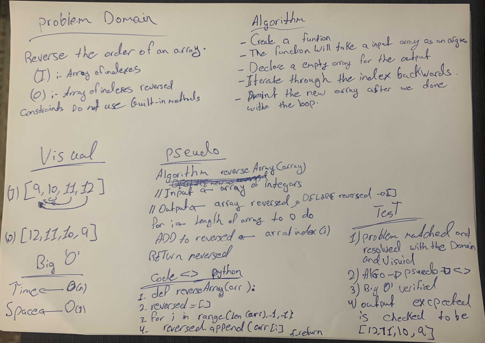

# Code Challenge: Class 01

**## Reverse an Array**

> function called reverseArray which takes an array as an argument. Without utilizing any of the built-in methods available to your language, return an array with elements in reversed order.

## Whiteboard Process

## Approach & Efficiency
Used for loop to reverse the array, inserted the values **of the reversed arrau** to the new array **reversed** and printed the array .Because this was the first thing came up to mined and i think 60% of developers will agree . 

The space of the code was following the O(1) and the time follows O(n), because the longer the input array gets, the longer it will take the code to be excuted.
