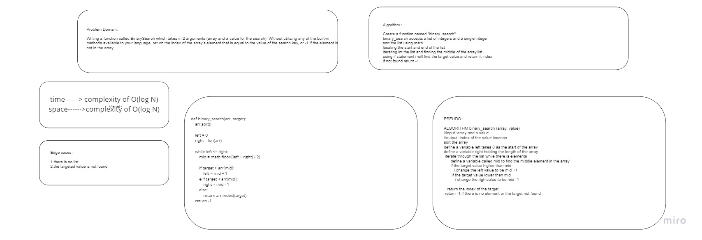

# Code Challenge: Class 03

# Binary Search of Sorted Array

Writing a function called BinarySearch which takes in 2 arguments (array and a value for the search). Without utilizing any of the built-in methods available to your language, return the index of the array’s element that is equal to the value of the search key, or -1 if the element is not in the array.

## Whiteboard Process

## Approach & Efficiency

i worked on the idea of neglecting half of the list on every iteration. And keeps on splitting the list until it finds the value it is looking for in a given list.

The time complexity of the binary search algorithm is O(log n). because it will depend on the list length , and the recursive method will be also dependet on the length and the value might not be found.
