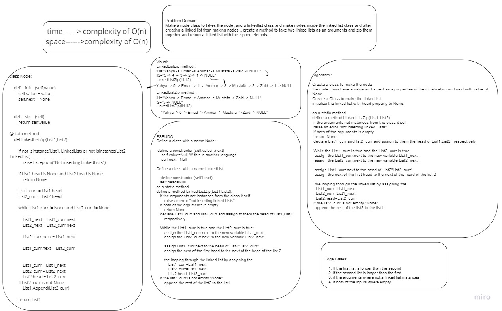

# Challenge Summary
 **Linked list**
 Creating :
### zip Linked List Method 
>arguments: List1, List2
-Takes two linked lists and connect them together in a certain way . zip method.

## Whiteboard Process

## Approach & Efficiency
    `class Node:`
    This class for structring the nodes inside the linked list .

    The Node  consists of a 'value' that holds 
    the node's value, and a 'next' that holds the 
    address of the next node

        
    `def LinkedListZip:`
    This function will Take two arguments (list1,lis2) and connect the two lists together in a pattern . zipping them together in a zigzag way . 
    the first form1 to the first from 2 and then 2nd from 1 and on ,on . 

    there is some edge cases explained in the whiteboard and the code itself
    
    

The complexity is O(n)for the worst case scenaario in my code
           

## Solution
[The code](./Linked_List_Zipped.py)