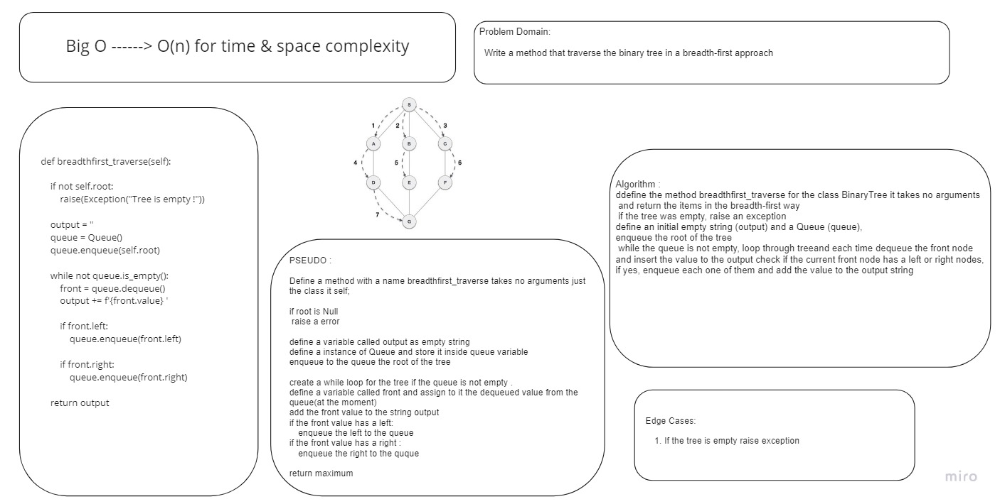

# Challenge Summary

Write a method that traverse the binary tree in a breadth-first approach

## Whiteboard Process

## Approach & Efficiency
define the method breadthfirst_traverse for the class BinaryTree, it takes no arguments and return the items in the breadth-first way define an initial empty string (output) and a Queue (queue), enqueue the root of the tree while the queue is not empty, i will loop through the tree and each time dequeue the front node and insert the value to the output check if the current front node has a left or right nodes, if yes, enqueue each one of them and add the value to the output string

BigO is o(n) for time & space complexity

## Solution
[Code](./Breadthtraverse.py)

[Tests](../tests/test_trees.py) Line 41 - end