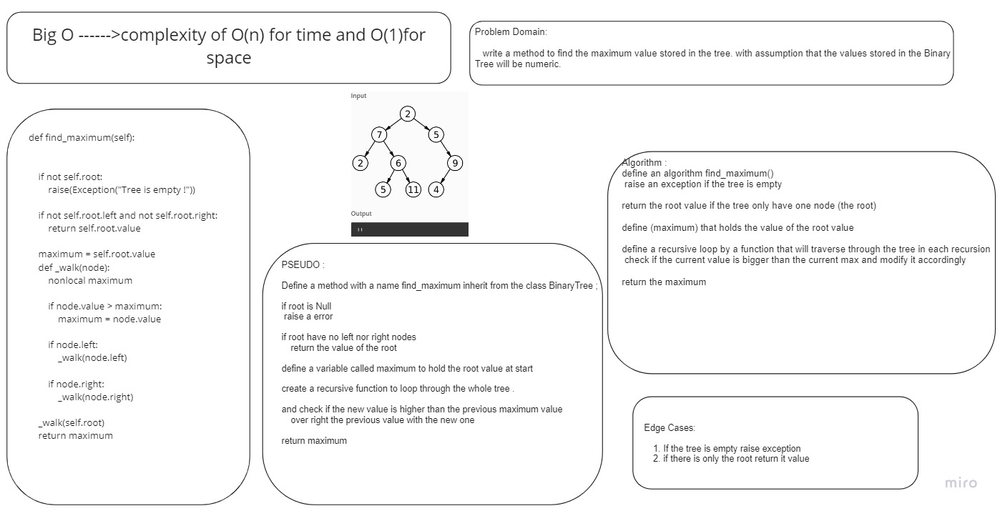

# Challenge Summary

Find the maximum value stored in the tree. with assumption  that the values stored in the Binary Tree will be numeric.

## Whiteboard Process

## Approach & Efficiency
define an algorithm find_maximum() raise an exception if the tree is empty return the root value if the tree only have one node (the root) define (maximum) that holds the value of the root value define a recursive loop by a function that will traverse through the tree in each recursion, check if the current value is bigger than the current max and modify it accordingly return the maximum

Big-O is o(n) for time because the rucrsive internal function, and o(1) for space.

## Solution
[Code](./max.py)

[Tests](../tests/test_trees.py) Line 22 - end