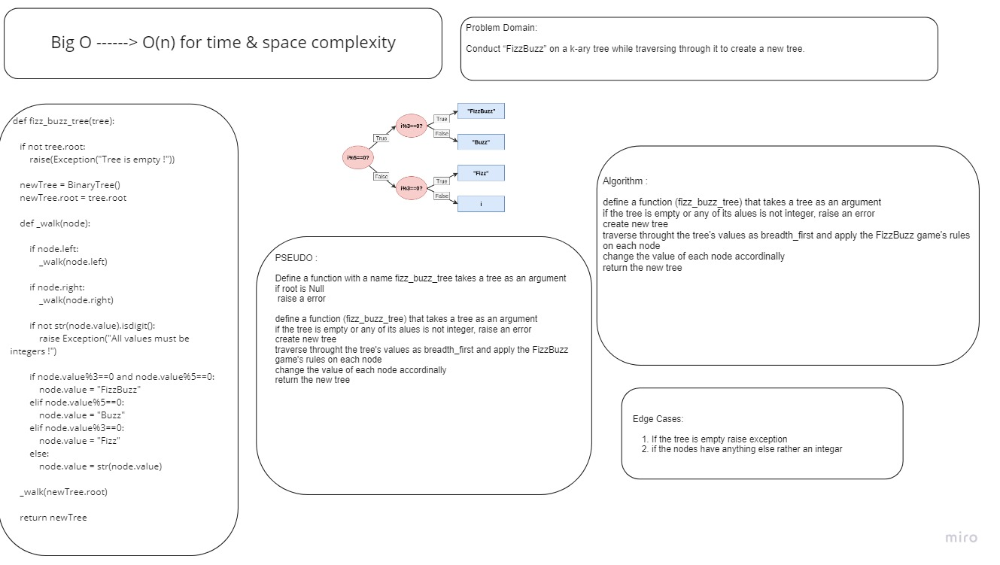

# Challenge Summary

> [Back](../../../README.md)

Write a function called fizz_buzz_tree that applies the Fizz Buzz game on a tree of integers and turn the values to string 

## Whiteboard Process

## Approach & Efficiency

define a function (fizz_buzz_tree) that takes a tree as an argument 
if the tree is empty or any of its alues is not integer, raise an error
create new tree 
traverse throught the tree's values as (pre-order) and apply the FizzBuzz game's rules on each node 
change the value of each node accordinally 
return the new tree 

Big-O is o(n) for time because the rucrsive internal function, and o(n) for space because we created a new tree

## Solution
[Code](./fizzbuzz.py)

## Tests

[Tests](../tests/test_trees.py) Line 45 - end