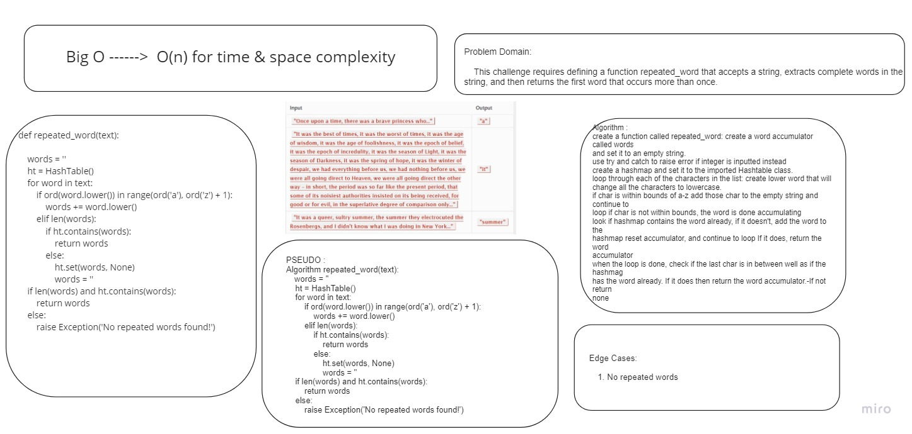

# Challenge Summary

    This challenge requires defining a function repeated_word that accepts a string, extracts complete words in the string, and then returns the first word that occurs more than once.

## Whiteboard Process

## Approach & Efficiency

    The function creates a hashtable in order to store key/value pairs in terms of the words found in the string passed to the function. Then, the function iterates through the hashtable and returns the first word that occurs more than once.

    Big O in regards to time is O(N) since in the worst case scenario we will have to iterate over all the words until we find a repeated word. Reagrding space, it is O(N) too since we create and add to a hashmap.

## Solution

[Code](./hash_table/hashmap.py)
[Tests](./tests/test_hash_map.py)