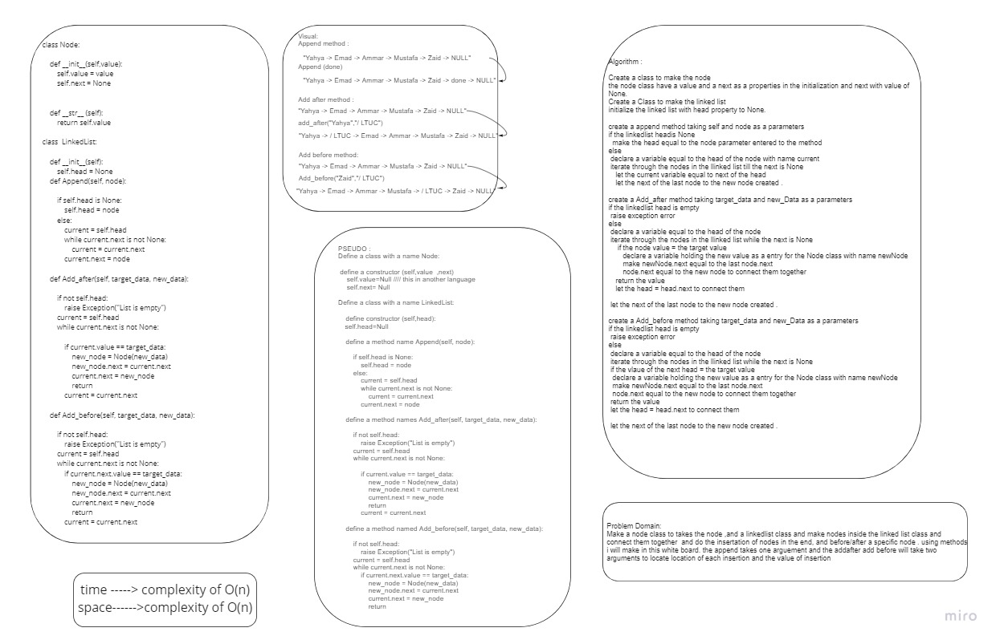

# Challenge Summary
 **Linked list Insertion**
 Creating :
### Append method 
>arguments: new value
-adds a new node with the given value to the end of the list.
### insert before
>arguments: value, new value
-adds a new node with the given new value immediately before the first node that has the value       specified.
### insert after
>arguments: value, new value
-adds a new node with the given new value immediately after the first node that has the value specified

## Whiteboard Process

## Approach & Efficiency
    `class Node:`
    This class for structring the nodes inside the linked list .

    The Node  consists of a 'value' that holds 
    the node's value, and a 'next' that holds the 
    address of the next node

        
    `def Add_after:`
    This Function will allow you to insert a new node after a node of your choice .
    you should give it to arguments (previous node "using next mutiple times to reach the required"previous node" , 
    new node you want to add after the previous one)
    

    `def Append:`
    This function inserts a value (Node instance) at 
    the (end) of the linked list
    

    `def Add_before:`
    This Function will allow you to insert a new node before a node of your choice .
    you should give it to arguments (the node where you want to add the value before, the value you want to add it )

The complexity is O(n)for the worst case scenaario in my code
           

## Solution
[The code](/linked_list_insertions.py)
