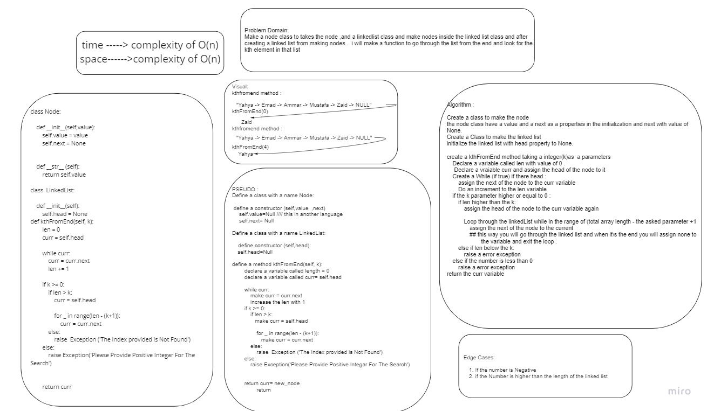

# Challenge Summary
 **Linked list**
 Creating :
### Kth from end method 
>arguments: k
-Search for the kth index from the linked list in a back order and rerurn the value of that node.

## Whiteboard Process

## Approach & Efficiency
    `class Node:`
    This class for structring the nodes inside the linked list .

    The Node  consists of a 'value' that holds 
    the node's value, and a 'next' that holds the 
    address of the next node

        
    `def kthFromEnd:`
    This function will Take one argument (k) and search for the value of index and return in but in backorder. 
    
    

The complexity is O(n)for the worst case scenaario in my code
           

## Solution
[The code](./linked_list_kth.py)