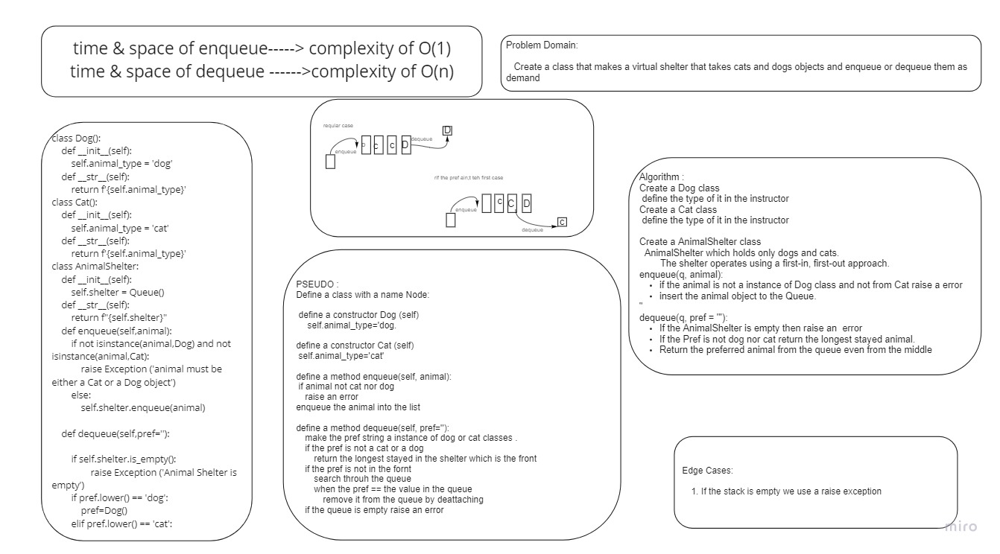

# Stack Queue Animal Shelter

> [Back to main](../../README.md)

---

# Challenge Summary

Create a class that makes a virtual shelter that takes cats and dogs objects and enqueue or dequeue them as demand

## Whiteboard 

## Approach & Efficiency

create a function (enqueue) inside the class (AnimalShelter)
it takes one argument (animal)

enqueue the input if it's only a instances of Dog and Cat only i fnot raise an error. 

create a function (dequeue) inside the class (AnimalShelter)
it takes one argument: the preferred animal 
check if the input is at the front of the queue and dequeue it and return it, if not raise an error
if the preferred is not a cat or a dog, or didn't specified, return the animal who waited the longest which is the first in
if the queue is empty, raise an error 

## Solution

[code](./stack_queue_animal_shelter/stack_queue_animal_shelter.py)
[tests](./tests/test_stack_queue_animal_shelter.py)
